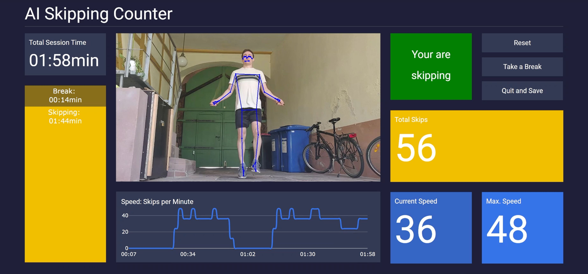

<!--  -->

# AI Skipping Counter

## Author
[@MiroGoettler](https://github.com/MiroGoettler)

## Table of Contents
- [Motivation](#motivation)
- [Solution](#solution)
- [Methods](#methods)
- [Dashboard](#dashboard)
- [How to use](#how-to-use)
- [Problems and Warnings](#problems-and-warnings)
- [Tech Stack](#tech-stack)

## Motivation
In this small project I present a **Python Dashboard for automatic counting of rope skips**. I got the idea for this project because I jump rope for my cardio two to three times a week. As with most training I was trying to improve my performance and started counting the number of skips and the time of the session. In contrast to counting other exercises like pushups, you have to count a lot faster and to a lot higher numbers. This can be quit annoying and take the fun out of the rope skipping workout.

## Solution
My solution to this problem is a [Plotly Dashboard](https://plotly.com/dash/) with an AI-based Counting System. In this dashboard the user can easily monitor the rope-skipping-session and see metrics like the total amount of skips, the speed of skipping and the time spend. With this Dashboard the user can concentrate on the physical effort and try to improve the performance without worrying about counting the skips.

## Methods
The actual Skip-Counting was implemented with **Human Pose Detection**. The Python Modul *Mediapipe* by Google provides ready-to-use and real-time methods for Pose Detection. The method provides a landmark model with 33 pose landmarks. For counting the skips, a relative height threshold was determined by observing many videos of rope skipping. If the landmark from the left or right foot surpasses this height threshold on skip is counted. Because you can rope skip with both feet at the same time, but can also jump alternating with each foot, the landmark of the foot with the highest Y-coordinate is chosen. This seems to be the simplest method for counting the skips.

In the GIF bellow you can see how the different skipping-styles are counted. For double jumps a second relative height line was determined. The height of booth lines is relative to the height of the user and could furthermore be adjusted to the likings of an individual user.


For calculating the location of these red lines, the position of the ankles at the start of a skipping-series is used. This means it also needs to be determined at which point the user starts skipping. The best indication for that is the angle of the arms. In the GIF bellow it is shown how the angle of the arms can be calculated and the average of both angles indicates at what point the skipping starts. 


## Dashboard
With the counting mechanism complete, we can display the information in a dashboard. This dashboard was designed to be very simplistic and easily readable. On the left side the overall session time is shown. Bellow that a graph visualizes the ratio between actual skipping time and the time the user took a break. Bellow the video stream another graph shows the progress of the users skipping speed over time. On the right side the top square indicates if the user is currently in skipping mode. Just right to that there are three buttons where the entire session can be reset, interrupted or quit and saved. Bellow that the total skip count is displayed in the yellow rectangle and underneath that the current and maximum speed are respectively displayed in blue rectangles.


## How to use
1. Create new conda environment from yml-file
```
conda env create -f environment.yml 
```
2. Activate environment
```
conda activate ai_skipping_counter_env
```
3. Run Python Dashboard in environment
```
python dashboard.py
```
4. Access local dashboard instance under http://127.0.0.1:8050/

## Problems and Warnings
- If the user changes his position while jumping and for example travels further away from the camera, the skipping is not counted correctly. This is because the heights (red lines) are determined and the beginning of each skipping-series and are not changed while skipping.
- If a user jumps very high on the single jumps it could be counted as a double jump. In the future it can be investigated if maybe other landmarks like the hands could be used to count the skips more accurately. 

## Tech Stack
- Python (refer to environment.yml for all packages used in this project)
    - Flask
    - Dash Plotly 
    - OpenCV
    - [Mediapipe by Google](https://google.github.io/mediapipe/getting_started/python.html)
